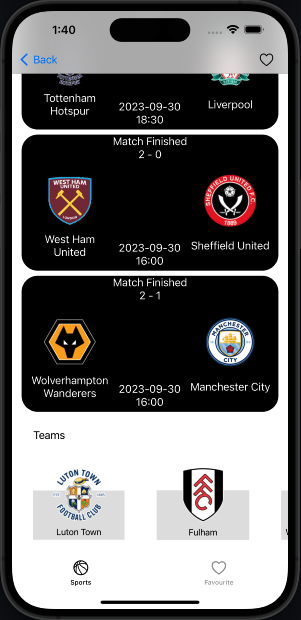

 # Sports App Using Swift ITI Project 
 Sports App is an iOS application that allows users to explore sports, view leagues, and stay updated with upcoming events and latest results. This README provides an overview of the app, its features, and instructions on how to set it up.

 team Members
 -Heba Elsisy
 -Ayman Mohamed

## Features

- **Main Screen**: The app has two main tabs:
  1. **Sports**: Displays available sports using a UICollectionView with images and names. Selecting a sport navigates to the Leagues ViewController.
  2. **Favorite Leagues**: Displays favorite leagues stored using Core Data. Allows navigation to LeagueDetailsViewController when online.

- **Leagues ViewController**: A UITableView displaying custom rows with league logos and names. Selecting a league navigates to LeagueDetailsViewController.

- **LeagueDetails ViewController**: Provides details about a league, including upcoming events, latest results, and teams.

- **TeamDetails ViewController**: Displays details of a team, including team information and relevant data.

## Setup

To run this project locally, follow these steps:

1. Clone this repository to your local machine.

2. Open the project in Xcode.

3. Make sure you have the necessary dependencies and libraries installed.
4. Go to https://allsportsapi.com/ and SignUP and get the API Key.
5. Navigate to /SportsApp/Core/HomeScreen/Model/SportsCategory.swift
6. Paste the Api key at The ApiKey Enum
7. Build and run the app on a simulator or a physical device.

 

   

## vedio Demo : 

screenshots:

